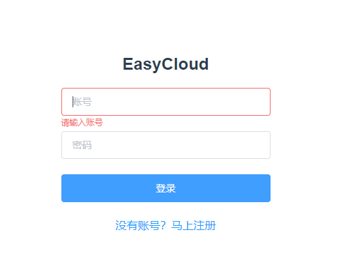
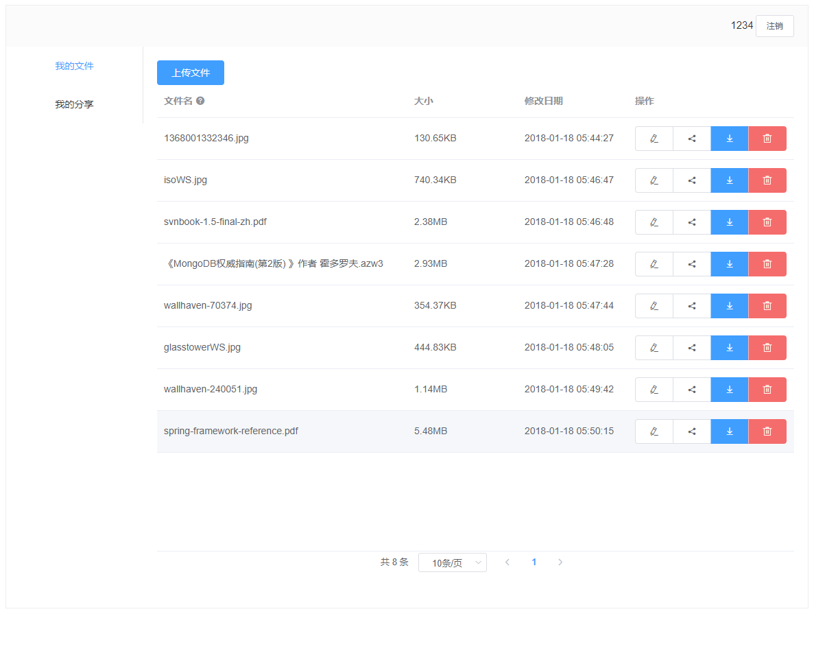
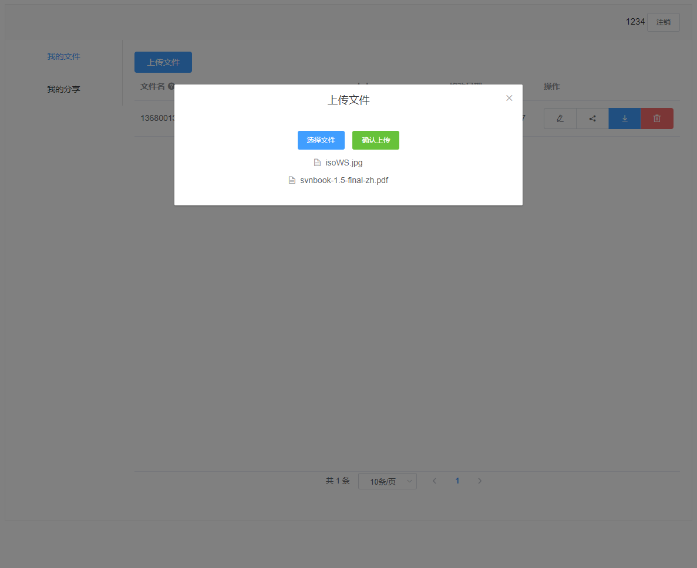
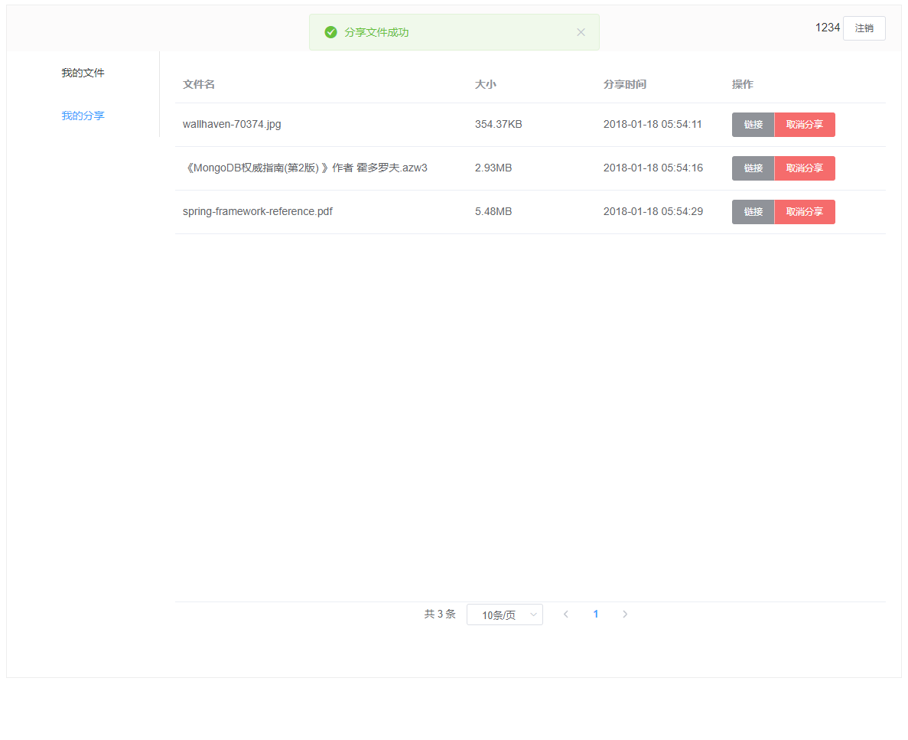
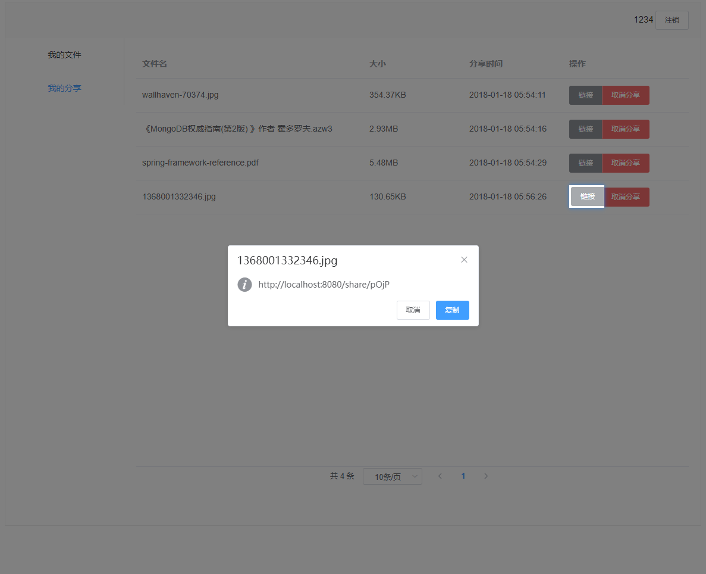
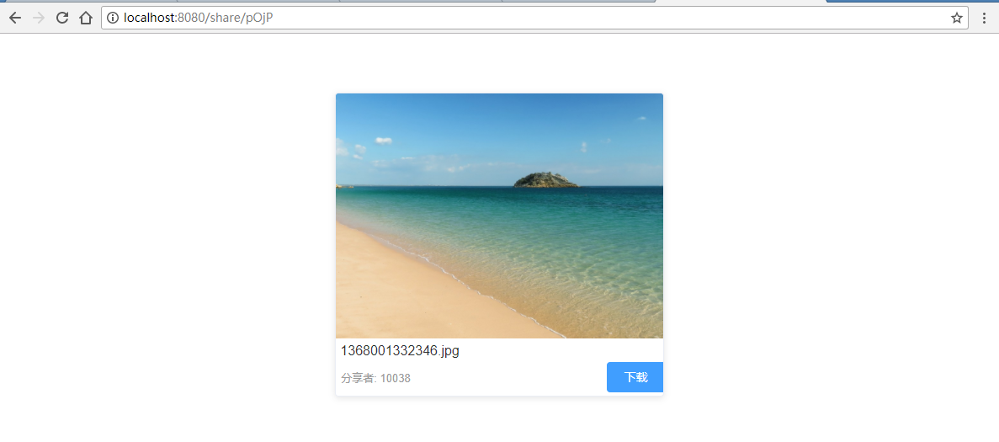

# EasyCloud  

[](https://travis-ci.org/pdwu/EasyCloud)
[](https://codecov.io/gh/pdwu/EasyCloud) 

## 简介
EasyCloud是一个前后端分离的简易文件云平台，支持上传和管理文件、图片在线预览和生成分享链接。  

## 技术栈
- 后端使用Spring, SpringMVC, Mybatis, MySQL实现,详见 [/server/README.md](./server/README.md)
- 前端使用Vue.js, Element UI实现

## 预览

- 登录注册  
  
- 我的文件页面  
  
- 上传文件  
  
- 我的分享页面  
  
- 查看分享链接  
  
- 访问链接  
  


---  

## 部署运行  

以下示例两种运行方式。

### 开发环境运行  
- 后端 `/server`
  1. `/src/resources/db.properties` 配置MySQL数据库连接信息 
  2. `/src/resoutces/app/easycloud.properties` 修改App配置（非必须） 
  3. 使用IDE导入项目并配置Tomcat运行  

- 前端 `/web`
  1. `npm install`
  2. 修改 `config/index.js` 中 `module.exports: dev.proxyTable.target` 为服务端地址
  3. `npm run dev`  

### 使用Nginx部署运行（生产环境）
- 1.修改配置（同上）  
  > 也可在 `/src/resoutces/spring/spring-mybatis.xml` 和 `src/main/java/com/pdwu/easycloud/common/config/AppConfig.java` 里面增加一条生产环境配置文件的路径

- 2.打包
  - 后端执行 `mvn clean package` 生成war包 
  - 前端执行 `npm run build` 在dist目录下生成静态文件

- 3.服务器部署
  - 运行后端，如使用Tomcat在上下文运行: `localhost:8080/easycloud`  路径：`/var/lib/tomcat/webapps/easycloud`
  - 将前端 `/dist` 目录下的所有文件拷贝到任一路径，如：`/home/myApps/easycloud_web`

- 4.Nginx配置  
  
  - 后端配置  `/etc/nginx/conf.d/easycloud.conf`  
    ```
    server {
      listen  9001;
      server_name localhost;
      root /var/lib/tomcat/webapps/easycloud;

      location / {
        proxy_pass http://localhost:8080/easycloud/;
      }
    }
    ```

  - 前端配置 `/etc/nginx/conf.d/easycloud_web.conf`  
    ```
    server {
        listen  80;
        server_name localhost;
    
        location / {
            root /home/myApps/easycloud_web;
            index index.html;
            try_files $uri $uri/ /index.html;
        }
    
        location /imgs {
            alias /home/myApps/easycloud_web/imgs;
        }
    
        location /api {
            proxy_pass http://localhost:8080/easycloud/api;
        }
    }
    ```  

- 注：以上是服务端部署在Tomcat上下文下的演示，部署在根目录需要相应改变